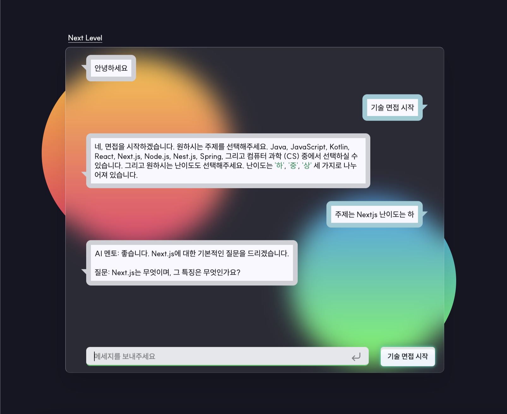

# AI-Mentor

해커톤의 주제였고 혼자 참여해서 우수상을 수상한 프로젝트

- 혼자서도 기술 면접이 가능하도록 AI 멘토가 먼저 면접질문등을 물어볼 수 있으며, 대답에 맞추어 꼬리질문이 가능.
- 프롬프트를 커스텀하여 AI 멘토의 역할, 사용법 설명, 질문 난이도를 설정하였음. 이로인해 본인의 상황에 맞게 질문을 체계적으로 받을 수 있음.
- 대화 내용 언제든 다시 볼 수 있도록 txt파일로 다운로드가 가능.
